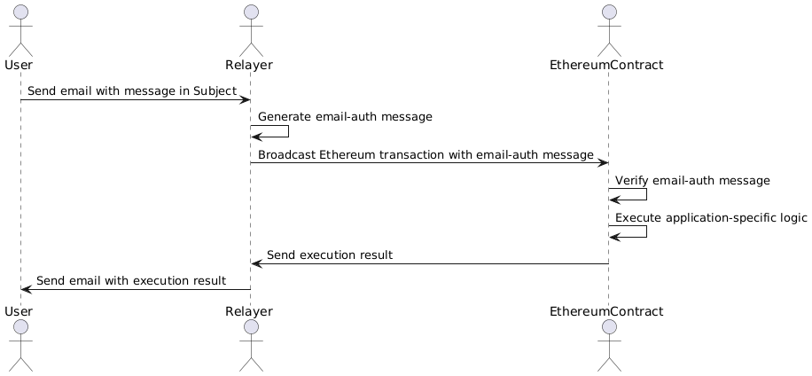

# Account Recovery

## Ether Email-Auth SDK

### Overview

One issue with existing applications on Ethereum is that all users who execute transactions on-chain must install Ethereum-specific tools such as wallets and manage their own private keys. Our ether email-auth SDK solves this issue: it allows users to execute any transaction on-chain simply by sending an email.

Using the SDK, a developer can build a smart contract with the following features without new ZKP circuits.

1. (Authorization) The contract can authorize any message in the Subject of the email that the user sends with a DKIM signature generated by an email provider, e.g., Gmail.
2. (Authentication) The contract can authenticate that the given Ethereum address corresponds to the email address in the From field of the email.
3. (Privacy) No on-chain information reveals the user's email address itself. In other words, any adversary who learns only public data cannot estimate the corresponding email address from the Ethereum address.

One of its killer applications is email-based account recovery, social recovery for account contracts such as Safe, Clave, and so on. In social recovery, the account owner must appoint trusted persons as guardians who are authorized to update the private key for controlling the account. However, not all such persons are necessarily Ethereum users. Our solution mitigates this constraint by allowing guardians to complete the recovery process simply by sending an email. In other words, any trusted persons can work as guardians as long as they can send emails. Using the ether email-auth SDK, we construct a library and tools for any account contract providers to integrate our email-based account recovery just by implementing a few Solidity functions and a frontend!

### Architecture

In addition to a user and a smart contract employing our SDK, there is a permissionless server called Relayer. The Relayer connects the off-chain world, where the users are, with the on-chain world, where the contracts reside, without compromising security. Specifically, the user, the Relayer, and the contract collaborate as follows:

1. (Off-chain) The user sends the Relayer an email containing a message to the contract in the Subject.
2. (Off-chain) The Relayer generates **an email-auth message for the given email, consisting of data about the Subject, an Ethereum address corresponding to the user's email address, a ZK proof of the email, and so on**.
3. (Off-chain -> On-chain) The Relayer broadcasts an Ethereum transaction to call the contract with the email-auth message.
4. (On-chain) After verifying the given email-auth message, the contract executes application-specific logic depending on the message in the Subject and the user's Ethereum address.
5. (On-chain -> Off-chain) The Relayer sends the user an email to report the execution result of the contract.

<figure><figcaption></figcaption></figure>
