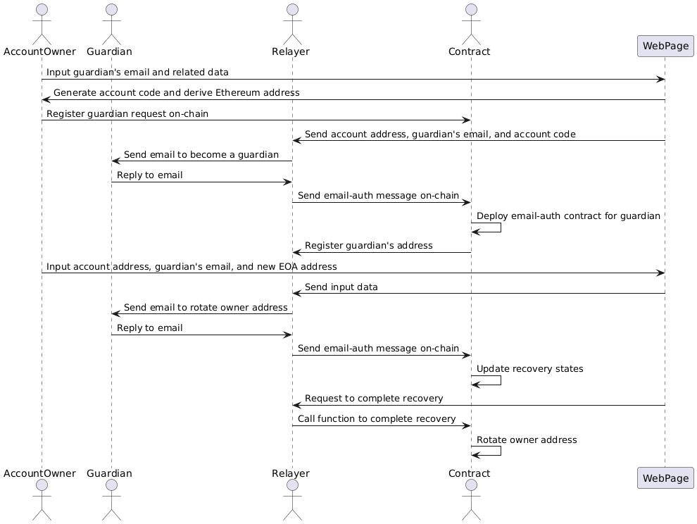

# Package Components

There are four significant packages in this repo:

#### `circuits` Package

It has a main circom circuit for verifying the email along with its DKIM signature, revealing a Subject message that masks an email address and an invitation code, and deriving an account salt from the email address in the From field and the given account code, which should match with the invitation code if it exists in the email. The circuit is agnostic to application contexts such as subject templates. **Therefore, a developer does not need to make new circuits.**

In a nutshell, our circuit 1) verifies the given RSA signature for the given email header and the RSA public key, 2) exposes the string in the Subject field except for the invitation code and the email address that appears in the Subject, and 3) computes the account salt derived from the email address in the From field and the given account code, which must be the same as the invitation code if it exists. In this way, it allows our on-chain verifier to authenticate the email sender and authorize the message in the Subject while protecting privacy.

For detailed setup instructions, see here.

#### `contracts` Package

It has Solidity contracts that help smart contracts based on our SDK verify the email-auth message. Among them, there are three significant contracts: verifier, DKIM registry, and email-auth contracts.

The verifier contract in `Verifier.sol` has a responsibility to verify the ZK proof in the given email-auth message. It is a global contract, that is, multiple users in your application will use the same verifier contract. You can deploy a new verifier contract once or use the already-deployed contract.

The DKIM registry contract has a responsibility to manage a mapping between an email domain name and its latest public keys used to verify the DKIM signatures. It should have mechanisms such that each user or some trusted custodians can rotate and void the registered public keys. For example, the contract in `ECDSAOwnedDKIMRegistry.sol` requires ECDSA signatures from an owner of the predefined Ethereum address. If you use the common trusted custodians for all users, you can deploy a new DKIM registry contract once or use the already-deployed contract. If each user should be able to modify the registered public keys, a new DKIM registry contract needs to be deployed for each user.

The email-auth contract in `EmailAuth.sol` is a contract for each email user. Its contract Ethereum address is derived from its initial owner address, an address of a controller contract that can define the supported subject templates and the account salt, i.e., the hash of the user's email address and one account code held by the user, through CREATE2. It provides a function `authEmail` to verify the email-auth message by calling the verifier and the DKIM registry contracts.

Your application contract can employ those contracts in the following manner:

1. For a new email user, the application contract deploys (a proxy of) the email-auth contract. Subsequently, the application contract sets the addresses of the verifier and the DKIM registry contracts and some subject templates for your application to the email-auth contract as its controller contract.
2. Given a new email-auth message from the email user, the application contract calls the `authEmail` function in the email-auth contract for that user. If it returns no error, the application contract can execute any processes based on the message in the email-auth message.

For detailed setup instructions, see here.

#### `relayer` Package

It has a Rust implementation of the Relayer server. Unfortunately, the current code only supports an application of the email-based account recovery described later. We will provide a more generic implementation in the future.

For detailed setup instructions, see here.

#### `prover` Package

It has some scripts for a prover server that generates a proof of the main circuit in the circuits package. The Relayer calls the prover server for each given email to delegate the proof generation. You can deploy the prover server either on your local machine or [Modal instances](https://modal.com/).

#### Security Notes

Our SDK only performs the verification of the email-auth message. **You have a responsibility to ensure security and privacy in your application.**

Here, we present a list of security notes that you should check.

* As described in the Subsection of "Invitation Code", for each email user, your application contract must ensure that the value of `isCodeExist` in the first email-auth message is true.
* The application contract can configure multiple subject templates for the same email-auth contract. However, the Relayer can choose any of the configured templates, as long as the message in the Subject matches with the chosen template. For example, if there are two templates "Send {decimals} {string}" and "Send {string}", the message "Send 1.23 ETH" matches with both templates. We recommend defining the subject templates without such ambiguities.
* To protect the privacy of the users' email addresses, you should carefully design not only the contracts but also the Relayer server, which stores the users' account codes. For example, an adversary can breach that privacy by exploiting an API provided by the Relayer that returns the Ethereum address for the given email address and its stored account code. Additionally, if any Relayer's API returns an error when no account code is stored for the given email address, the adversary can learn which email addresses are registered.

### Application: Email-based Account Recovery

As a representative example of applications using our SDK, we provide contracts and a Relayer server for email-based account recovery. They assume a life cycle of the account recovery in four phases:

1. (Requesting a guardian) An account owner requests a holder of a specified email address to become a guardian.
2. (Accepting a guardian) If the requested guardian sends an email to accept the request, the Ethereum address of the email-auth contract corresponding to the guardian's email address is registered on-chain.
3. (Processing a recovery for each guardian) When a guardian sends an email to recover the account, the state data for the recovery is updated.
4. (Completing a recovery) If the required condition for the recovery holds, the account recovery is done.

Specifically, we expect the following UX. **Notably, the guardian only needs to reply to emails sent from the Relayer in every process.**

1. (Requesting a guardian 1/4) A web page to configure guardians for email-based account recovery requests the account owner to input the guardian's email address and some related data such as the length of timelock until that guardian's recovery request is enabled.
2. (Requesting a guardian 2/4) The frontend script on the web page randomly generates a new account code and derives the guardian's Ethereum address from the input guardian's email address and that code. It then requests the account owner to send a transaction to register the guardian request on-chain, passing the derived Ethereum address and the related data (not the private data such as the email address and the account code).
3. (Requesting a guardian 3/4) The frontend script also sends the account address, the guardian's email address, and the account code to the Relayer.
4. (Requesting a guardian 4/4) The Relayer then sends the guardian an email to say "The owner of this account address requests you to become a guardian".
5. (Accepting a guardian 1/3) If confirming the request, the guardian replies to the Relayer's email.
6. (Accepting a guardian 2/3) The Relayer sends an email-auth message for the guardian's email on-chain.
7. (Accepting a guardian 3/3) If the given email-auth message is valid, an email-auth contract for the guardian is deployed, and its address is registered as the guardian.
8. (Processing a recovery for each guardian 1/6) When losing a private key for controlling the account, on the web page to recover the account, the account owner inputs the account address to be recovered, the guardian's email address and a new EOA address called owner address derived from a fresh private key.
9. (Processing a recovery for each guardian 2/6) The frontend script sends the input data to the Relayer.
10. (Processing a recovery for each guardian 3/6) The Relayer then sends the guardian an email to say "Please rotate the owner address for this account address to this EOA address".
11. (Processing a recovery for each guardian 4/6) If confirming the requested recovery, the guardian replies to the Relayer's email.
12. (Processing a recovery for each guardian 5/6) The Relayer sends an email-auth message for the guardian's email on-chain.
13. (Processing a recovery for each guardian 6/6) If the given email-auth message is valid, the states for the recovery are updated.
14. (Completing a recovery 1/2) When the frontend script finds that the required condition to complete the recovery holds on-chain, e.g., enough number of the guardian's confirmations are registered into the account contract, it requests the Relayer to complete the recovery.
15. (Completing a recovery 2/2) The Relayer sends a transaction to call a function for completing the recovery. If it returns no error, the owner address should be rotated.

<figure><figcaption></figcaption></figure>
