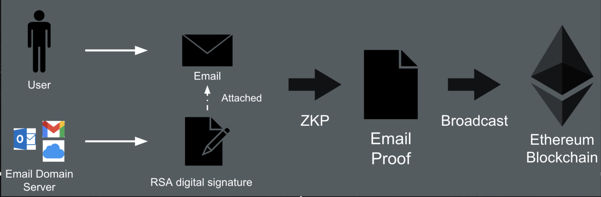

# Email Wallet

The ZK-Email Wallet is a non-custodial cryptocurrency wallet managed via email. It is a smart contract wallet that uses zk-SNARKs to verify the validity of the email messages. Assets in your email wallet remain secure as long as your email domain server of your email account (such as Gmail) does not forge your emails.

The wallet is managed by users through email, leveraging [zk-email](../zk-email-verify/) or proof of email technology for trustless operations.

ZK-Email is a mechanism that validates the existence of an email message and verifies statements about any data contained within it. This technology can be used to build a trustless bridge from Web2 to Web3, without the need for third-party intermediaries like oracles such as Chainlink. In this context, email serves as a source of oracle data.

## How it Works

Emails you send are (usually) signed using a private key controlled by your email domain server according to a DKIM protocol. This signature is included in the headers section of the email.

The DKIM signature is used to verify the email was sent by you and lets you securely control your wallet. Instead of verifying the signature directly on-chain, a zk proof of signature is created (by a permissionless entity called Relayer) and verified on-chain.

Here is how a typical interaction with the wallet looks like:

* You send an email to your Relayer's email address with a subject like "Send 1 ETH to recipient@gmail.com".
* The Relayer verifies the DKIM signature and creates a zk proof of email.
* The ZK circuit also validate the subject regex, recipients email address and the amount to be sent.
* Private data like the sender email, recipient's email in the subject line, is not exposed on-chain.
* The Relayer create an Ethereum transaction that reflect the intended action in the subject.
* The smart contract verify the ZK Proof and ensure the subject line matches the transaction.
* The smart contract executes the transaction and sends 1 ETH to recipient's Email Wallet address.
* The Relayer wait for the transaction confirmation, and sends you and the recipient an email with the transaction details.

